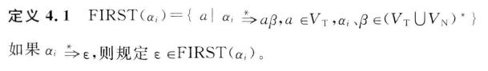

# LR(1)语法分析程序

# 实验内容

编写LR(1)语法分析程序,实现对算术表达式的语法分析。要求所分析算数表达式由如下的文法产生:

```
E -> E+T | E-T | T
T -> T*F | T/F | F
F -> (E) | num
```

# 程序设计与实现

**使用方式**：运行`.\lr1-parser.exe "<表达式>"`

1. 生成FIRST`fn get_first(&mut self)`
    
    
    
    
    
2. 计算LR(1)项目集规范族和go(I,X)转移函数：
    1. 实现closure(I)的构造`fn compute_closure(&self, kernel: Closure) -> Closure`
        
        
        
    2. 构造识别该文法所有活前缀的 DFA。`fn get_dfa(&mut self)`
        
        
        
    3. 构造该文法的 LR 分析表action。`fn get_action(&mut self)`
        
        
        
        程序运行输出的构造的分析表如下（节选）：
        
        
        
        
        
3. 编程实现算法 4.3,构造 LR 分析程序。
    
    
    
    程序分析输出过程如下：
    
    
    
    由于输出较长，故摘取部分输出。
    

# 错误处理

当不能识别输入的表达式时，会抛出错误，程序终止。例如运行`.\lr1-parser.exe "123+456-789*25.2/(7-3"`：


# 程序输出

执行分析`.\lr1-parser.exe "123+456-789*25.2/(7-3)"`，对表达式**123+456-789*25.2/(7-3)**进行分析的程序输出结果见`output.txt`。

# 源程序

在目录`src/`下。

# 可执行程序

Windows下运行`.\lr1-parser.exe "<表达式>"`，其中`"<表达式>"`为用引号括起来的待分析表达式字符串。

Linux下可运行`.\lr1-parser "<表达式>"`。